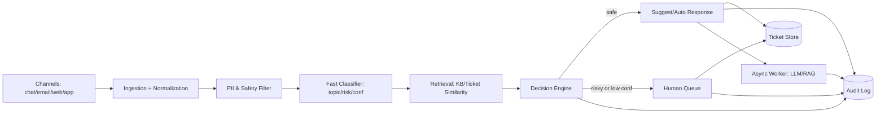

# architecture.md — целевая архитектура

## 1) Цель системы

- Автоматизировать обработку части тикетов поддержки: классификация, риск-оценка, маршрутизация, подготовка черновика ответа.
- Сохранить безопасность и качество: рискованные/неуверенные случаи — только через оператора.
- Обеспечить аудит: каждое автоматическое решение воспроизводимо и логируется.

## 2) Основные компоненты

- Ingestion (каналы): чат / email / web / mobile → нормализация в единый формат Ticket.
- PII/Safety фильтр: детект и маскирование PII, policy-валидация, защита от prompt-injection (на уровне контента).
- Fast Path Classifier (≤500 ms): тема/категория + risk_level + confidence.
- Retrieval: поиск похожих тикетов и/или фрагментов базы знаний (KB).
- Decision Engine: правила принятия решения (auto-suggest / route-to-human / auto-close safe).
- Async Worker: генерация черновика ответа, суммаризация, дедупликация при инцидентах, пересчёт embeddings.
- Storage:
  - Ticket Store (сырьё и статусы)
  - KB Store (контент + версии)
  - Vector Store (эмбеддинги KB/тикетов)
  - Audit Log (неизменяемые логи решений)
- Human-in-the-loop UI/Queue: очередь операторов, интерфейс подтверждения/редактирования.
- Monitoring/Analytics: метрики, алерты, дашборды, контроль LLM cost.

## 3) Поток данных (end-to-end)

### 3.1 Синхронный путь (hot path)

1. Принять тикет из канала и нормализовать.
2. Прогнать через PII/Safety фильтр (минимум: маскирование и policy).
3. Быстрая классификация: topic + risk + confidence.
4. Retrieval (упрощённо/кэшируемо) для получения evidence.
5. Decision Engine:
   - safe + high-confidence → можно сформировать предложение (draft) или авто-маршрут.
   - risky или low-confidence → route-to-human.
6. Записать Audit Log.
7. Ответить upstream-системе: статус + маршрут (и при необходимости “черновик готовится”).

### 3.2 Асинхронный путь (slow path)

- Если разрешено политикой: сформировать draft-ответ через LLM/RAG.
- Сохранить draft + источники (evidence) + версии промпта/модели в Audit Log.
- Доставить draft оператору (suggest-mode), либо пользователю (только для safe категорий и только при выполнении политики качества).

## 4) Human-in-the-loop и запасные пути

- Human-in-the-loop:
  - risky категории (оплата, аккаунт, юридические угрозы, безопасность)
  - low-confidence (ниже порога)
  - подозрение на prompt injection / PII policy violation
- Fallback при недоступности LLM:
  - не генерировать ответ; оставить только классификацию+маршрутизацию
  - использовать шаблонные ответы без персонализации
  - деградировать retrieval до простого keyword search

## 5) Хранилища и аудит

- Audit Log должен содержать:
  - вход (обезличенный/маскированный), метаданные
  - результат классификации и confidence
  - источники retrieval (ID документов/тикетов, score)
  - решение (route/auto/suggest) и причина (policy)
  - версии моделей/правил/промптов/конфигов

## 6) Диаграммы (Mermaid)

## 7) Assumptions и границы PoC

- [ ] Какие компоненты реально реализованы в PoC:
- [ ] Какие компоненты описаны только как дизайн:
- [ ] Целевые SLO/SLA и пороги confidence (и почему такие):
